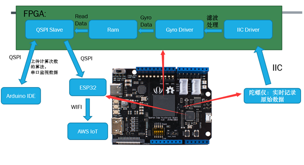

#### 中文
# 2020年新工科联盟-[Xilinx](https://www.xilinx.com/)暑期学校（Summer School）项目
# 队伍名称：农夫山泉
## 小组成员 ： 周扬集  杨文豪
## 项目名称：A13 摇摇乐
## 工具版本(点击下载)：[Vivado 2018.3（VerilogHDL)](https://china.xilinx.com) ， [Arduino1.8.9(C,C++)](https://www.arduino.cc/en/Main/Software)，[AWS Iot](https://aws.amazon.com/tw/education/awseducate/) ，[Vscode(html，css，JavaScript)](https://code.visualstudio.com/)
## 板卡型号：xc7s15ftgb196-1
## 外设：无

title:FPGA+ESP32+AWS IoT数据处理和数据通信平台：

---
## 项目流程图

---
## 项目概要 
---
### Vivado
1. 为[FPGADemo](https://github.com/DoneSEA/SEA)添加QSPI模块，支持串口数据输出。
2. 使用[Vivado 2018.3](https://china.xilinx.com)进行编译生成bit文件。
3. 将bit文件移入tf卡的overlay文件夹
### Arduino
1. 对开发板进行烧写。
2. 编写计算摇动次数程序通过qspi上传到FPGA。
3. 通过arduino串口监视器监测摇动次数的数据
### AWS Iot
1. 创建事物、策略等。
2. 通过wifi接收数据。
3. 使用MQTT订阅主题观察数据情况。

---
## 成果展示

---
## 仓库目录介绍
---
### images
1. arduino串口监视
2. AWS loT服务器数据监视
3. 项目框图
4. 作品照片

### Sourcecode
1. vivado源码
2. arduino源码

### ExecutableFiles
1. bit文件

